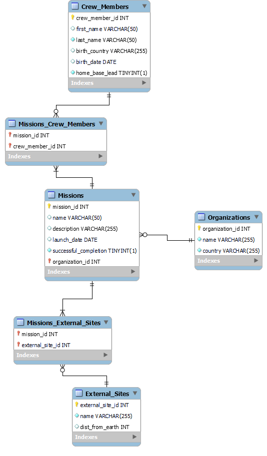

# Space-Flight-Database

**Team Members:** Austin Webber and Max Wild

## Install and Run the package
### (Inside a terminal window in the file directory:)
Command to install packages:

`npm install`

Command to run server:

`npm start`

Command to run server in dev mode (so auto restarts when JavaScript updates):

`npm devStart`

## Background

Exploring the universe is a difficult and expensive task. Humans carry out space missions to observe and gain insight into the phenomena of the universe, to test scientific theories established on earth, and to search for viable economic opportunities. The Space Flight Database will document these challenges by cataloging human space flight missions in an SQL database. 

367 human spaceflight missions and hundreds more unmanned missions have occurred around the world as of this writing. NASA itself has already launched 135 extraterrestrial missions and 355 people into space since its establishment. The administration works in collaboration with the 6 other major worldwide space agencies, Roscosmos (Russia), ESA (Europe), JAXA (Japan), and CSA (Canada), as well as many other influential agencies. This tremendous combined scientific effort between Earth’s nations requires a strong database backend. 

With upward trends for space flight expansion, this database will support cataloging for on average 40 crew members launched on space flights a year, as well as 100 new crew members a year in space flight programs not affiliated with missions. The database can store information about the 160 currently existing space agencies, and it can handle new entries for upcoming organizations as well. It will be able to store mission plans at the current rate of about 10 missions per year, as well as at an increased rate for the future. It presently will store 1,000 external sites of interest that may be in mission objectives. The main purpose of this database is to provide functionality to review recent and upcoming missions, and it will deliver summary metrics as well.

## Database Schema

