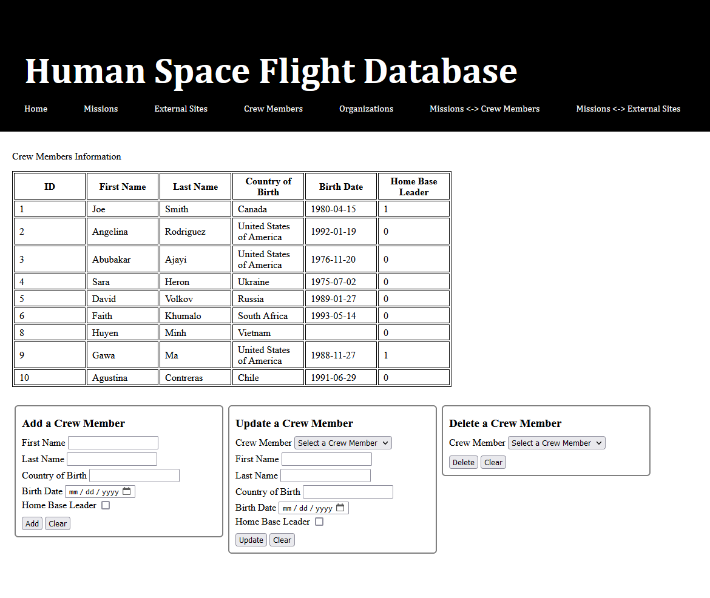

# 🪐 Space-Flight-Database 🌠

**Team Members:** 🛰️Austin Webber🛰️ and 🚀Max Wild🚀

## 📡 Overview

⭐ The Space Flight Database is a **MySQL project** used to track the progress of human space flight. It tracks **four entities**--missions, crew members, externa sites, and space organizations. It uses a **webpage frontend** for users to enter database updates and search information inside.

⭐ It includes **two intersections tables** for managing the relationships between missions / crew and missions / organizations. These relationships are cleanly updated when the database receives a deletion request, such as deleting a mission which used to be associated with other groups.

⭐ Complete **CRUD operations** are implemented both for the frontend and server side handling of the database. This is Create, Read, Update, and Delete capabilities, and it was achieved using SQL commands. **Handlebars** is used with Node.js for server side templating. The **static SQL read queries** are located in `/database/queries/read/`, and all **dynamic SQL queries** are generated in the `/database/query_master.js` JavaScript file, depending on what data is to be created, updated, or deleted. The missions entity allows for **keyword search**, using an SQL query to search for missions by name. In the UI, all **input HTML elements are automatically updated** using JavaScript when an select element value is picked.

Enjoy!

## 🌌 Background

Exploring the universe is a difficult and expensive task. Humans carry out space missions to observe and gain insight into the phenomena of the universe, to test scientific theories established on earth, and to search for viable economic opportunities. The Space Flight Database will document these challenges by cataloging human space flight missions in an SQL database. 

367 human spaceflight missions and hundreds more unmanned missions have occurred around the world as of this writing. NASA itself has already launched 135 extraterrestrial missions and 355 people into space since its establishment. The administration works in collaboration with the 6 other major worldwide space agencies, Roscosmos (Russia), ESA (Europe), JAXA (Japan), and CSA (Canada), as well as many other influential agencies. This tremendous combined scientific effort between Earth’s nations requires a strong database backend. 

With upward trends for space flight expansion, this database will support cataloging for on average 40 crew members launched on space flights a year, as well as 100 new crew members a year in space flight programs not affiliated with missions. The database can store information about the 160 currently existing space agencies, and it can handle new entries for upcoming organizations as well. It will be able to store mission plans at the current rate of about 10 missions per year, as well as at an increased rate for the future. It presently will store 1,000 external sites of interest that may be in mission objectives. The main purpose of this database is to provide functionality to review recent and upcoming missions, and it will deliver summary metrics as well.

## 👽 Install and Run the package

### 📁 Inside a terminal window in the file directory:

Command to install packages:
`npm install`

Command to run server:
`npm start`

Command to run server in dev mode:
[so it auto restarts when a JavaScript file is updated]:
`npm devStart`

### 🔌 Connecting to a database:

Note that the host, username, and password settings for connecting to a database must be set in `/database/db-connector.js`.

### ⚡ Setting up the database:

Once your database is up, running, and ready to be connected to, tell it to run `DDL.sql` found in `/docs/` to set up the tables. Then, tell it to run `DML.sql` to populate the tables with initial data!

Connect to the database at [http://]localhost:23374.

## 🔭 Database Schema

## 👩‍🚀 Citations

 | All code written in every JavaScript file is written  
 | originally, based on the CS 340 tutorial lesson pages from  
 | OSU and other online resources, with the exception  
 | of db-connector.js which was heavily adapted from CS  
 | 340 code online. Also, the addCommas helper function  
 | was taken from GitHub, which documented in the code,  
 | however it was never used. 
